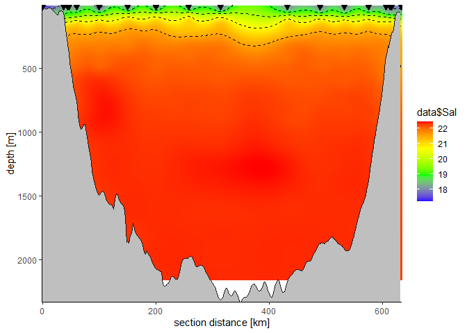
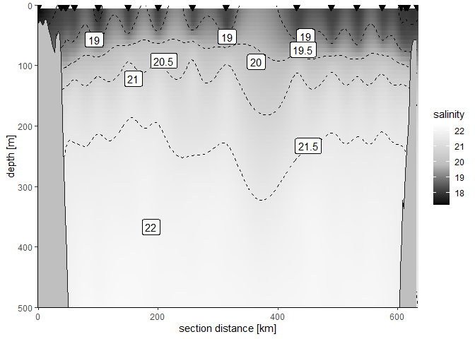

Section
================
David

### Description

A function to draw an oceanographic section of interpolated data along a
transect. Requires packages `sp`, `marmap`, `MBA`, `reshape2`, and
`ggplot2`.

### Arguments

*longitude* – vector of latitude in degrees north

*latitude* – vector of longitude in degrees east

*parameter* – vector of values of parameter z to be interpolated and
plotted as color; accepts NAs but all Lon-Lat-Depth-Parameter
combinations with parameters NA will be removed

*depth* – vector of depth values in m, negative numbers are accepted but
will be converted to positives

*xy.ratio* = NULL – optional integer vector of length 2 in which first
and second integers indicate the relative strength of interpolation in x
and y direction, defaults to NULL and calculates the required values
according to mean depth resolution and distance between stations

*section.x* = “km” – unit for x axis of the section; options are “km”
(the default), “degE”, and “degN”

*section.direction* = NA – optional sorting of data by stations along a
dominant direction. Options are “N”, “E”, “S”, and “W”, e.g. “S” creates
a section running from north to south. If nothing is input, data vectors
will not be resorted

*bathymetry* = NULL – optional bathymetry of class “bathy”, if not
supplied will be retrieved from NOAA for the domain of “longitude” and
“latitude”

*keep.bathy* = FALSE – should the downloaded bathymetry be kept offline;
this would make repeated plotting faster

*max.depth* = “profile” – select the section’s maximum depth in
bathymetry (“profile”, the default) or in data (“data”) as the maximum
depth of the plot

*contour.breaks* = 5 – either an integer defining the number of contour
bins (defaults arbitrarily to 5), or a vector of values for the contour
lines.

### Value

A named list containing the $plot, the $input data with the distance of
stations along the section (according to sorting via
*section.direction*), the $output data of the interpolated results (as a
long table), and the $profile of bathymetry under the section.

### Example

The example data from the Black Sea is available for download [from
PANGEA](https://doi.pangaea.de/10.1594/PANGAEA.898717). Because the
downloaded data is not sorted properly, the general cruise direction
from west to east is indicated by *section.direction = “E”*.

``` r
data <- read.table("Kaiser-etal_MSM33.tab", sep = "\t", skip = 99, header = TRUE)

example <- section(longitude = data$Longitude,
                   latitude = data$Latitude,
                   parameter = data$Sal,
                   depth = data$Depth.water..m.,
                   section.direction = "E")
```

### Output

#### Plot

``` r
example$plot 
```

<!-- -->

Because the $plot is a ggplot2 object, it can be modified and extended.

``` r
example$plot +
  coord_cartesian(ylim=c(500,0)) +
  metR::geom_label_contour(data = example$output,
                           aes(section.x, depth, z = parameter)) +
  scale_fill_gradientn(colours = c("black", "grey", "white"), name = "salinity")
```

<!-- -->

#### Tables

The other objects in the results list are simple data frames.

``` r
head(example$input)
```

    ##   longitude latitude parameter depth  section.x
    ## 1   31.1403 45.02997   17.2305   1.5 0.00000000
    ## 2   31.1403 45.03010   17.2497  10.0 0.01444735
    ## 3   31.1403 45.03010   17.4900  20.0 0.01444735
    ## 4   31.1403 45.03010   17.8401  30.0 0.01444735
    ## 5   31.1403 45.03020   17.8487  32.5 0.02556070
    ## 6   31.1403 45.03020   18.2096  40.0 0.02556070

``` r
head(example$output)
```

    ##   section.x depth parameter
    ## 1  0.000000   1.5  17.20472
    ## 2  2.116863   1.5  17.23667
    ## 3  4.233726   1.5  17.30980
    ## 4  6.350589   1.5  17.39558
    ## 5  8.467452   1.5  17.48017
    ## 6 10.584315   1.5  17.55927

``` r
head(example$profile)
```

    ##         lon      lat section.x depth
    ## 2  31.13370 45.02793  0.000000    31
    ## 6  31.14943 45.01117  2.236433    25
    ## 7  31.16516 44.99441  4.473066    28
    ## 8  31.18089 44.97765  6.709898    33
    ## 9  31.19662 44.96089  8.946931    29
    ## 10 31.21235 44.94413 11.184163    22
