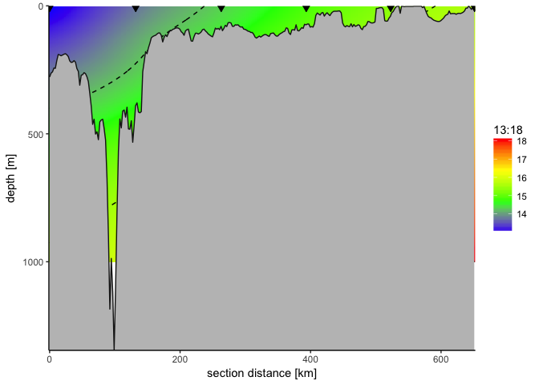

# Section example
David Kaiser; david.kaiser.82@gmail.com  

Function to draw a section of interpolated data along a transect

 + requires vectors of corresponding lon, lat, depth, and data values
 + accepts the input of bathymetry data as class "bathy", or creates bathymetry
 + requires selection of distance, longitude or latitude as x values
 + requires selection of a dominant section orientation towards N, E, S or W
 + requires the following packages to be installed: "sp", "marmap", "reshape2", "MBA", and "ggplot2"
 + value is a list containing a ggplot of the sections with interpolated data and bathymetry profile and three data frames containing the interpolated data, the bathymetry profile, and the input data with section distance [km] added, respectively.
  The list objects are named "plot", "output", "profile", and "input", respectively.


```r
example.results <- section.DK(longitude = 15:20,
                              latitude = 50:55,
                              parameter = 13:18,
                              depth = c(0, 100, 300, 500, 700, 1000))
```

```
## Querying NOAA database ...
## This may take seconds to minutes, depending on grid size
## Building bathy matrix ...
```

```r
# FIXME: Why do input vectors must have same lengths??
```

# Output

## Plot


```r
example.results$plot
```

<!-- -->

## Tables


```r
head(example.results$input)
```

```
##   longitude latitude parameter depth section.x
## 1        15       50        13     0    0.0000
## 2        16       51        14   100  131.9366
## 3        17       52        15   300  263.0662
## 4        18       53        16   500  393.3712
## 5        19       54        17   700  522.8337
## 6        20       55        18  1000  651.4356
```

```r
head(example.results$output)
```

```
##   section.x depth parameter
## 1  0.000000     0  13.00000
## 2  2.178714     0  13.00568
## 3  4.357429     0  13.01185
## 4  6.536143     0  13.01849
## 5  8.714858     0  13.02558
## 6 10.893572     0  13.03311
```

```r
head(example.results$profile)
```

```
##        lon      lat section.x depth
## 2 14.99167 49.99167  0.000000   278
## 3 15.00833 50.00833  2.203088   263
## 4 15.02500 50.02500  4.405952   258
## 5 15.04167 50.04167  6.608594   243
## 6 15.05833 50.05833  8.811011   244
## 7 15.07500 50.07500 11.013205   214
```


# ToDo:

 + labeled contour lines (not provided by ggplot geom_contour function, available workaround 'directlabels' does not help)
